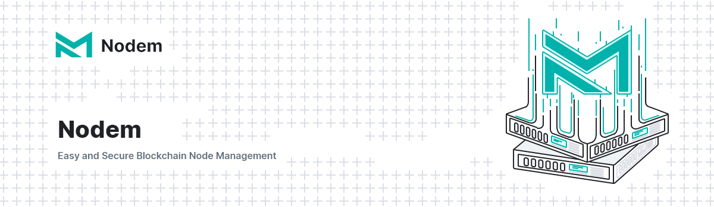

# Nodem



Nodem is an all-in-one tool for managing your ARK Core-based blockchain nodes with integrations for popular server providers, such as DigitalOcean and Hetzner. Nodem is no longer in development.

## Installation

### Requirements

- [Composer](https://getcomposer.org)
- [Yarn](https://yarnpkg.com/en/docs/install) _(development only)_
- [Valet](https://laravel.com/docs/5.7/valet) or [Homestead](https://laravel.com/docs/5.7/homestead) _(development only)_

### Other requirements

The application relies on the `cmd` function that is used to run a `ping` command on the terminal and extract the server response time, this function should work in most cases but there are some considerations to take in mind:

- The `ping` command may not work in Windows-based servers
- Some servers may not have permission to run the PHP `cmd` function.

### Production

Clone the repository and install the dependencies

```bash
git clone https://github.com/ArkEcosystem/nodem.git
cd nodem
composer install --no-dev
```

Configure the environment
> We advise using Redis for cache and queues.

```bash
cp .env.example .env
php artisan key:generate
```

> Make sure to adjust the `APP_URL` variable in your .env file to reflect the host, e.g the IP address of the server where Nodem runs

```
APP_URL=http://127.0.0.1
```

Prepare the application.

This will guide you in generating the invitation code that you need to create your first account (owner).

```bash
php artisan nodem:install
```

Symlink storage directory and start Horizon

```bash
php artisan storage:link
php artisan horizon
```

### Development

Currently, the instructions are for Valet

```bash
git clone https://github.com/ArkEcosystem/nodem.git
cd nodem
composer install
yarn install

cp .env.example .env
php artisan key:generate

> Make sure to adjust the `APP_URL` variable in your .env file to reflect the host, e.g the IP address of the server where Nodem runs

```
APP_URL=http://127.0.0.1
```

php artisan storage:link
composer db:dev # or composer db:bare
yarn run watch

valet link nodem
```

Afterwards, you can navigate to `nodem.test` in your browser to see it in action

#### Two-Factor Authentication

By default, the site will require all logged-in users to have Two-Factor Authentication setup on their account. This can be disabled by adding `TWO_FACTOR_ENABLED=false` to the `.env` file.

#### Custom Dropdown component

There is a dropdown component which is a variation of the UI dropdown component. This incorporates repositioning of dropdown. A copy of the component is kept here as it causes a breaking change across all other projects, along with `:init-alpine="false"` no longer being supported.

## Testing

You can run the unit tests with `php artisan test` or `./vendor/bin/pest`. Check the `phpunit.xml` file for the default settings, as the tests will require a database in order to run. If you end up adjusting the `phpunit.xml` file to run your tests, please ensure that you do not commit those changes.

## Known Limitations

Although Nodem in its current state will work, there are possible improvements to be made over time. These are outlined in the [Known Limitations](KNOW_LIMITATIONS.md) document in this repository and are a good starting point if you are interested in contributing.

## Contributing

Please see [Contributing Guidelines](https://docs.ark.io/guidebook/contribution-guidelines/contributing.html) for details.

## Credits

This project exists thanks to all the people who [contribute](../../contributors).

## AS-IS Clause

Nodem is provided "AS-IS" and without any warranty of any kind, whether express, implied or statutory, including but not limited to the warranties of merchantability, fitness for a particular purpose, and non-infringement. The entire risk as to the quality and performance of Nodem is with you. Should Nodem prove defective, you assume the cost of all necessary servicing, repair, or correction.

In no event shall the author of Nodem be liable to you or any third parties for any damages arising out of or in connection with the use or inability to use Nodem, including but not limited to damages for loss of profits, business interruption, or loss of data, even if the author of Nodem has been advised of the possibility of such damages.

By using Nodem, you agree to indemnify and hold harmless the author of Nodem and any contributors to Nodem from and against any claims, actions, or demands, including without limitation reasonable legal and accounting fees, arising from or related to your use of Nodem or your violation of these terms and conditions.

## Copyright

Nodem is an open-source all-in-one tool for managing your ARK Core blockchain nodes with integrations for popular server providers, hereinafter referred to as "the Program". The Program is licensed under the terms of the GNU General Public License version 3 ("GPLv3").

Copyright (C) 2023 [ARK Ecosystem](https://arkscic.com/)

This program is free software: you can redistribute it and/or modify
it under the terms of the GNU General Public License as published by
the Free Software Foundation, either version 3 of the License, or
(at your option) any later version.

This program is distributed in the hope that it will be useful,
but WITHOUT ANY WARRANTY; without even the implied warranty of
MERCHANTABILITY or FITNESS FOR A PARTICULAR PURPOSE. See the
GNU General Public License for more details.

You should have received a copy of the GNU General Public License
along with this program. If not, see <https://www.gnu.org/licenses/>.

## License

[GNU General Public License v3.0](LICENSE) © [ARK Ecosystem](https://arkscic.com/)
